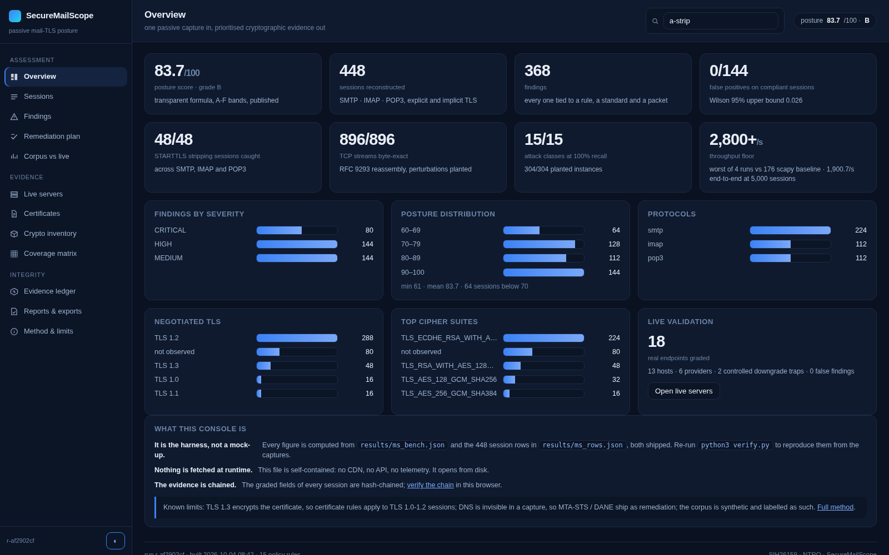
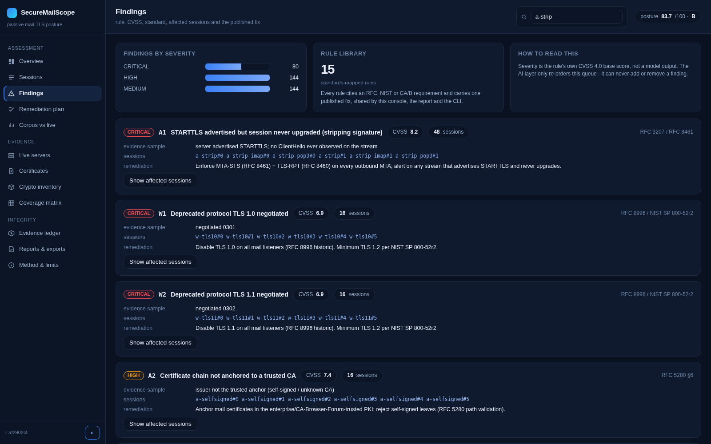
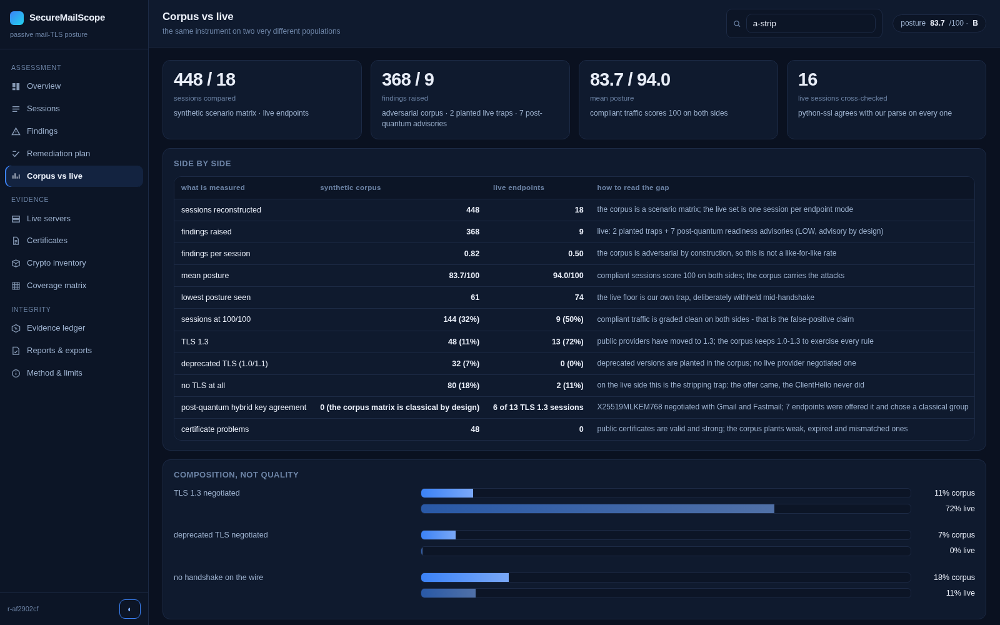
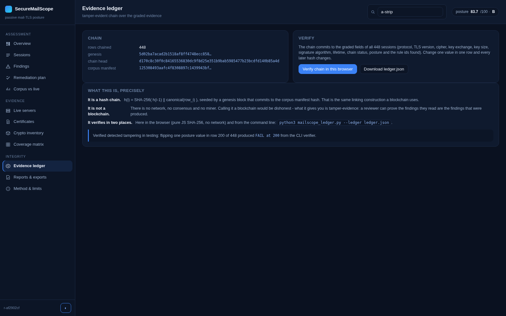

# SecureMailScope

Passive cryptographic posture assessment for mail TLS. It reads a packet capture and grades how each
mail connection actually negotiated its encryption, then reports findings with the RFC and the CVSS
score behind every one.

**SIH 2026 - problem statement 26159 (NTRO) - Blockchain and Cybersecurity**

## Start here (60 seconds)

1. Open `console/index.html`. One self-contained file, twelve pages, no server and no network.
2. On **Evidence ledger**, press **Verify chain in this browser**: it re-hashes all 448 graded rows
   with SHA-256 and compares them against the published head. Nothing is fetched, nothing is trusted
   from our process.
3. On **Sessions**, type `a-strip` and open any row: STARTTLS was advertised and no ClientHello ever
   followed - the finding, its RFC, its CVSS and its fix sit next to the packet-level evidence.
4. On **Remediation plan**, press **Every CRITICAL rule** and the corpus answers: 83.7 -> 86.5/100,
   48 of 368 findings removed, 48 of 448 sessions cleared.
5. To check every number yourself: `python3 verify.py` -> 55 checks, including byte-level
   re-derivation of all 448 sessions.


## Highlights

* **Passive.** Reads PCAP files from a SPAN/mirror port or an offline capture. Nothing is installed
  on the mail server, nothing is probed actively, nothing is decrypted: TLS record headers and X.509
  certificates only, never message content.
* **Grounded in the wire.** Rebuilds TCP streams (RFC 9293) and TLS handshakes, including handshake
  messages split across records, then grades every session against a 15-rule policy library mapped
  to RFCs, NIST SP 800-52r2 and the CA/Browser Forum Baseline Requirements.
* **Catches the quiet failures.** A server that advertises STARTTLS and then never sees a
  ClientHello, a downgraded TLS version, a weak suite or key, a chain that does not anchor, a
  certificate that is expired or lives too long.
* **AI ranks, rules decide.** A gradient-boosted risk model orders findings and a deviation model
  flags unusual client stacks. Both are assistive, so a model miss can never invent a finding.
* **The evidence is chained.** Every graded field of every session is hashed into a chain seeded by
  the corpus manifest; the head is published in `results/ledger.json` and one entry is kept per row.
  Change one value in one row and the chain breaks at that row. `verify.py` recomputes it from the
  shipped bytes, and the console re-verifies the same chain in the browser with no network at all.

## Measured results

| Metric | Result |
|---|---|
| Corpus | 448 synthetic mail sessions (SMTP, IMAP, POP3; explicit and implicit TLS) -> 368 findings |
| Attack classes caught | 15/15 at 100% recall (304/304 planted instances) |
| False positives | 0/144 on compliant sessions, Wilson 95% upper bound 0.026 |
| STARTTLS stripping | 48/48 sessions caught across SMTP, IMAP and POP3 |
| TCP reassembly | 896/896 streams byte-exact, including out-of-order, retransmit and overlap |
| Posture scoring | mean 83.7/100 over the corpus, compliant sessions at 100/100 |
| Throughput | 2,800+ sessions/s single thread, against 176 for a scapy rdpcap baseline |
| Risk classifier | held-out F1 0.9538, accuracy 0.9459, Brier 0.045 (n = 111) |
| Anomaly layer | 16/16 custom client stacks flagged, 0 false alarms on compliant traffic |
| Live validation | 16 real endpoints, 13 hosts, 6 providers, 2 controlled downgrade traps, 0 false findings |
| At scale | 5,000 sessions (17.2 MB of capture) read, reassembled and graded in 2.63 s = 1,900/s end to end; 10,000/10,000 byte-exact; 107 MB peak |
| Live vs corpus | 16 public endpoints on 13 hosts across 6 providers graded, plus 2 controlled traps caught; 16/16 cross-checked against the standard ssl stack; 0 certificate or protocol findings on the honest endpoints |
| Post-quantum, measured on the wire | a **real X25519MLKEM768 hybrid handshake captured from OpenSSL 3.5.6** and decrypted through the keylog path (certificate recovered, `ms_pq/pq_validation.json`); of 13 public TLS 1.3 endpoints, **6 negotiate the hybrid group** (Gmail, Fastmail) and **7 were offered it and chose a classical group** - reported as rule **P1, LOW advisory**, never as a break |
| CBOM export | CycloneDX 1.6 bill of materials built from capture bytes alone - protocols, cipher suites, key agreement (hybrid flagged with its quantum category), certificates; `python3 mailscope_cbom.py captures/ --out cbom.json` |
| Problem statement | 21/21 expected deliverables, see `docs/DELIVERABLE_MAPPING.md` |

Re-derive every figure from the shipped captures:

```bash
pip install -r requirements.txt
python3 verify.py        # 55 checks, including byte-level re-derivation of each session row
```

## Layout

| Path | What it is |
|---|---|
| `mailscope/engine.py` | capture generation and measurement harness: TCP reassembly, TLS parsing, X.509 checks, policy engine, ML layers |
| `mailscope/report.py` | report layer: HTML dashboard, forensic report, JSON and PDF export |
| `mailscope/console.py` | builds the operator console: one self-contained HTML file, twelve routed pages |
| `mailscope/ledger.py` | tamper-evident evidence ledger: build, verify against the published head, export |
| `scale_test.py` | scale harness: one run over thousands of sessions, writes `results/ms_scale.json` |
| `mailscope/keylog.py` | TLS 1.3 keylog path: decrypt the handshake from a capture + keylog and grade the certificate it hides |
| `mailscope/live.py` | grades real public mail endpoints and writes the live evidence |
| `mailscope/analyze.py` | CLI: grade any capture you bring, with remediation per finding |
| `verify.py` | 45 independent checks over the shipped numbers |
| `data/corpus/` | the 448-session corpus and the test CA used to mint its certificates |
| `data/live/` | captures from real public mail servers |
| `results/` | benchmark output, throughput history, live validation, published evidence ledger |
| `report/` | generated report artifacts (dashboard, forensic report, JSON, PDF) |
| `console/` | the console (plus `console/screenshots/`), ready to open in a browser |
| `docs/` | problem statement record and the deliverable mapping |
| `deck/` | the 6-slide idea submission (PDF and PPTX) |

## Usage

```bash
python3 verify.py                  # re-check every claim above (55 checks)
python3 -m mailscope.report        # -> report/report.html, report/report.json, report/report.pdf
python3 -m mailscope.console       # -> console/index.html (single self-contained file)
python3 -m mailscope.engine        # regenerate the corpus and the benchmark
python3 -m mailscope.live          # grade real public MTAs -> data/live/, results/live_validation.json
python3 -m mailscope.analyze yours.pcap   # grade your own capture (table + JSON, exit code for CI)
python3 -m mailscope.ledger --ledger results/ledger.json   # re-verify the published evidence chain
python3 scale_test.py              # reproduce the scale run -> results/ms_scale.json (add a number for fewer)
python3 -m mailscope.keylog --verify results/keylog_validation.json   # re-derive the TLS 1.3 certificate
make verify                        # the same commands are wrapped in the Makefile
```

## The console

One self-contained HTML file, twelve hash-routed pages, no CDN and no network calls of any kind:

| Page | What it shows |
|---|---|
| Overview | posture score, the headline counts, severity / protocol / TLS / cipher mix |
| Sessions | all 448 reconstructed sessions, filterable, each opening a full evidence drawer |
| Findings | every rule: severity, CVSS, the RFC behind it, affected sessions, remediation |
| Remediation plan | pick rules, see the measured counterfactual: projected posture, findings removed, sessions cleared |
| Corpus vs live | the same instrument on two populations: 448 adversarial synthetic sessions beside 18 real endpoints, with the deltas explained |

The console, as shipped (all twelve pages, one self-contained file, no network):

| | |
|---|---|
|  |  |
| Overview: corpus roll-up, protocol mix, the posture floor | Findings: every finding carries the rule, the evidence and the fix |
|  |  |
| Corpus vs live: the same instrument on two populations | Evidence ledger: hash-chained, one row per finding |
| Live servers | the 16 real endpoints that were graded, with the python-ssl cross-check |
| Certificates | subject, issuer, serial, SAN, key size, signature algorithm, lifetime, chain status |
| Crypto inventory | negotiated versions, suites, key exchange, key sizes and JA3/JA4 counts (CBOM export) |
| Coverage matrix | 28 scenario classes x 16 replicas, every cell opening its own evidence |
| Evidence ledger | the chain facts and an in-browser SHA-256 re-verification of all 448 rows |
| Reports & exports | one-click JSON, CSV, CEF, CBOM and ledger downloads |
| Method & limits | the pipeline, the stated limits, and the mapping to the 21 expected deliverables |


## Deploy the console

The console is one self-contained HTML file with no network calls, so GitHub Pages can serve it
directly: **Settings -> Pages -> Deploy from a branch -> main / root**. The included root
`index.html` redirects to `console/`, so the site root is the live console.

## Method and limits

* **Passive by design.** The analyser only reads captured traffic. That is what makes STARTTLS
  stripping visible: the victim's own logs show nothing beyond a missing handshake line.
* **Chain validation is cryptographic.** The leaf signature is re-verified against the trust
  anchor's public key with a raw RSA/ECDSA verify, not merely parsed. Modern libraries refuse to
  validate SHA-1-signed certificates, so the SHA-1 test leaf is minted by DER surgery.
* **Fingerprinting** uses JA3 and JA4 (FoxIO specification) with GREASE filtering. JA4 is the stable
  one under extension reordering, which is why the allow-list approach was measured and rejected.
* **Anomaly model choice was measured, not assumed.** A JA4 allow-list flagged outliers but also
  produced false alarms on unseen compliant stacks, and IsolationForest alone missed them because
  only two attributes separated the outlier. A nominal-attribute deviation score with a 3-sigma
  control limit separated the two with zero false alarms.
* **The corpus is synthetic** (the problem statement permits a synthetic dataset) and generated by
  the harness with real X.509 material from a small test CA. `verify.py` re-reads every capture and
  reproduces each row from the bytes, so nothing depends on trusting the JSON.
* **TLS 1.3 encrypts the certificate** by design (RFC 8446 section 4.4.2), so certificate-based
  rules apply to TLS 1.0 to 1.2 sessions; TLS 1.3 sessions are graded on version, cipher suite and
  handshake presence. When the endpoint's SSLKEYLOGFILE can be supplied, the same capture does yield
  the certificate: `data/keylog/` carries a real TLS 1.3 IMAPS session and the keylog, the module
  derives the handshake traffic keys (HKDF-Expand-Label, RFC 8446 section 7.1), opens the records and
  grades the certificate - and proves the recovered certificate is byte-identical to the one the
  server was holding.
* **DNS is invisible in a capture**, so MTA-STS (RFC 8461), DANE (RFC 7672) and TLS-RPT (RFC 8460)
  checks are emitted as remediation guidance, not as findings.
* **Scale is measured on synthetic traffic only.** One run grades 5,000 sessions (17.2 MB) in
  2.63 s with 107 MB peak memory, and reassembly stayed byte-exact at that size - but the sessions
  are synthetic and generated on the same machine, and a real mirror port also has to write the
  capture to disk, so this is the analysis pipeline, not the switch. The risk model is trained on
  labels taken from the corpus manifest, which is why it can only rank findings the rule engine
  already produced.

## Team

* Team: Team_Null_Pointer
* Team ID: 184553
* Demo video: https://youtu.be/vgka20UhJEE
* Demo video (GDrive): https://drive.google.com/file/d/1z7FH2AkG0fA7z6vNjlRdEsDbJDCgW30b/view?usp=sharing
* Live console: https://shinnok-build.github.io/SecureMailScope/console/

## License

MIT, see `LICENSE`.
